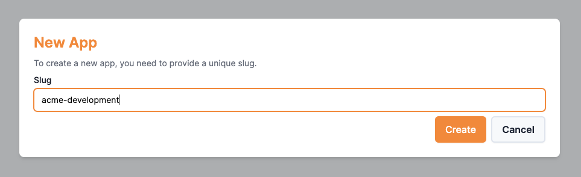
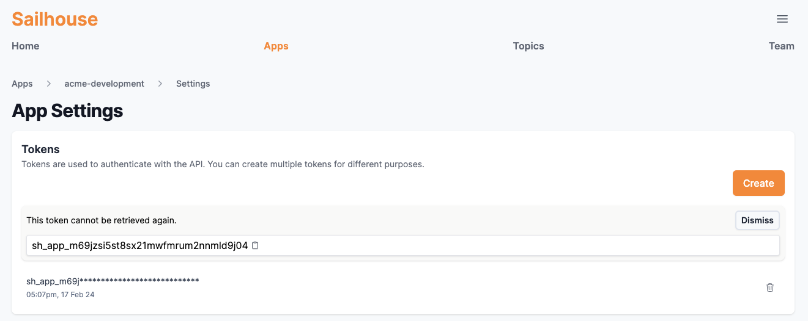

## Sending an event

<Steps>
  <Step title="Creating an account">
    First things first, [get signed in](https://app.sailhouse.dev) and create your team.
  </Step>
  <Step title="Creating an app">
    In Sailhouse, [apps](/concepts/apps.mdx) are the logical separators for your topics. This could be environments, projects or both!

    <Frame>
        
    </Frame>
  </Step>
  <Step title="Create a token">
    To send an event to an application, we need a token to pass into our SDK.

    Go to your [new app](https://app.sailhouse.dev/apps) > **Settings** > **Create**

    <Frame>
        
    </Frame>
  </Step>
  <Step title="Start sending events">
    <Tabs>
      <Tab title="Go">
        First, adding the SDK package

        ```bash Adding the package
        go get -u github.com/sailhouse/sdk-go/sailhouse
        ```

        Then, a basic example which reads the token from an environment variable `SAILHOUSE_TOKEN`.

        ```go main.go
        package main

        import (
            "github.com/sailhouse/go-sdk/sailhouse"
        )

        func main() {
          client := sailhouse.NewSailhouseClient(os.Getenv("SAILHOUSE_TOKEN"))

          client.Publish("awesome-example", map[string]string{
            "message": "Hello World!",
          })
        }
        ```
      </Tab>
      <Tab title="TypeScript / JavaScript">
        First, installing the SDK.

        ```bash Intsalling the package
        npm install @sailhouse/client
        ```

        Then a basic example ,taking advantage of top-level await.

        ```ts index.ts
        import { SailhouseClient } from "@sailhouse/client";

        const client = new SailhouseClient(process.env.SAILHOUSE_TOKEN);

        await client.publish("signups", {
          email: "hello@sailhouse.dev",
          type: "pro",
        });
        ```

      </Tab>
    </Tabs>
  </Step>
</Steps>

## Next steps

<CardGroup cols={2}>
  <Card
    title="Install the CLI"
    icon="square-terminal"
    href="cli-reference/introduction"
  >
    Do everything you need from your terminal with the Sailhouse CLI
  </Card>
  <Card
    title="Learn about subscriptions"
    icon="book-open-cover"
    href="/concepts/subscriptions"
  >
    You've sent an event, now see what you can do with it
  </Card>
</CardGroup>
